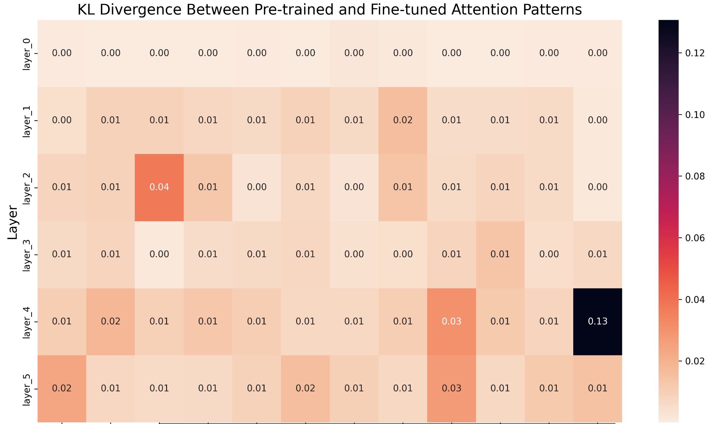

# GPT-2 Fine-tuning for Text Summarization with Interpretability Analysis

## Project Title and Author Information
**Project Title**: Mechanistic Interpretability of GPT-like Models on Summarization Tasks  
**Author**: Anurag Mishra  
**Institution**: Rochester Institute of Technology  
**Contact**: am2552@rit.edu  
**Course**: IDAI-780 Capstone Project

## Cover Figure or Framework


## Introduction
Mechanistic interpretability represents a critical frontier in NLP, enabling researchers to understand the internal mechanisms of large language models beyond black-box approaches. This project investigates how GPT-like models process and generate text summaries, focusing on latent-space transformations during summarization.

Our experiments compare zero-shot and fine-tuned GPT-2 on the CNN/DailyMail dataset, establishing differences in internal representations and attention patterns. The analysis incorporates metrics including Attention Entropy, Activation Magnitudes, and Representational Similarity Analysis.

### Framework Overview


## Code Structure Overview
```
.
├── gpt2_summarization.py          # Main training and evaluation script
├── visualize_metrics.py           # Visualization generation script
├── analyze_latent_space.py        # Latent space analysis utilities
├── setup_environment.sh           # Environment setup script
├── run_experiment.sh              # Experiment execution script
├── requirements.txt               # Python dependencies
│
├── interpretability_metrics/      # Stored interpretability metrics
├── visualizations/                # Generated visualization files
├── logs/                          # Training and experiment logs
├── images/                        # Framework diagrams and result visualizations
└── checkpoints/                   # Model checkpoints (gitignored)
```

## Dataset Description and Preparation
This work utilizes the CNN/DailyMail dataset (version 3.0.0), a widely established benchmark for abstractive summarization tasks. The dataset comprises over 300,000 news articles with human-generated summary highlights.

The dataset is divided into standard splits:
- 287,113 articles for training
- 13,368 for validation
- 11,490 for testing

Articles average approximately 766 words (29.7 sentences), while summaries average 53 words (3.7 sentences). This significant compression ratio makes the dataset particularly relevant for summarization tasks.

For preprocessing, we employ the GPT-2 tokenizer, apply standard cleaning procedures including special character removal and whitespace normalization, and truncate documents to fit the 1024 token limit of our model.

## Installation and Environment
### Prerequisites
- Python 3.8+
- CUDA-compatible GPU (recommended)
- Conda package manager

### Setup
1. Create and activate the conda environment:
```bash
conda create -n gpt2_finetune python=3.8 -y
conda activate gpt2_finetune
```

2. Install dependencies:
```bash
pip install -r requirements.txt
```

3. Run the setup script:
```bash
./setup_environment.sh
```

## Usage: Training and Testing
### Training
To run the full experiment:
```bash
./run_experiment.sh
```

This will:
1. Fine-tune GPT-2 on the CNN/Daily Mail dataset
2. Generate interpretability metrics
3. Create visualizations
4. Save model outputs

### Monitoring
Monitor training progress using TensorBoard:
```bash
tensorboard --logdir=logs
```

## Evaluation Methodology
While output quality metrics provide surface-level evaluations, mechanistic interpretability requires specialized metrics to quantify model internals. Our approach employs both model-internal and output-quality assessments.

### Interpretability Metrics
These metrics directly quantify model-internal mechanisms across adaptation stages:

1. **KL Divergence of Attention Distributions**: Quantifies attention pattern shifts during adaptation, identifying heads undergoing reconfiguration for summarization. Compares distributions between fine-tuned and pre-trained models.

2. **Attention Entropy**: Measures focus of attention mechanisms. Lower entropy indicates focused attention on specific tokens; higher entropy indicates diffuse attention. Quantifies whether summarization adaptation leads to concentrated attention on salient information.

3. **Representational Similarity Analysis (RSA)**: Tracks how internal representations evolve through model layers and how transformations differ between pre-trained and fine-tuned variants, revealing adaptation effects on hierarchical feature extraction.

4. **Activation Magnitudes**: Identifies layers contributing most significantly to model behavior, locating critical processing stages in summarization pathways by measuring average magnitude of activations in each layer.

### Summarization Metrics
While less informative about internal mechanisms, these metrics benchmark output quality:

- **ROUGE-1, ROUGE-2, ROUGE-L**: Measure unigram, bigram, and longest common subsequence overlap between generated and reference summaries.
- **METEOR**: Evaluates semantic similarity accounting for synonyms and stemming.

These provide standardized benchmarks but offer limited insight into internal model mechanisms.

## Demo Example
### Sample Input (Article)
```
The president announced a new policy on climate change that aims to reduce carbon emissions by 50% by 2030. The announcement was made during a press conference where he outlined several initiatives to combat global warming and promote renewable energy. Environmental experts have praised the ambitious target, though some industry leaders have expressed concerns about implementation costs.
```

### Sample Output (Generated Summary)
```
The president announced a new policy on climate change that aims to reduce carbon emissions by 50% by 2030. Environmental experts have praised the ambitious target, though some industry leaders have expressed concerns about implementation costs.
```

## Results and Visualizations
The project generates several types of visualizations stored in the `visualizations/` directory:

1. **Attention Head Evolution**
   - GIF showing attention head metrics evolution
   - Interactive HTML visualizations
   - Heatmaps of attention patterns

2. **Latent Space Analysis**
   - 3D UMAP visualizations
   - Interactive HTML plots
   - Evolution GIFs

3. **Model Metrics**
   - Temporal metrics evolution
   - Weight changes visualization
   - Gradient norm analysis
   - Neuron activation patterns

All visualizations are accessible through the generated HTML report at `visualizations/interpretability_report.html`.

## Preliminary Results and Discussion

### Summarization Performance
| Model | ROUGE-1 | ROUGE-2 | ROUGE-L | ROUGE-Lsum |
|-------|---------|---------|---------|------------|
| GPT-2 (zero-shot) | 18.75% | 1.14% | 13.56% | 16.32% |
| GPT-2 (fine-tuned) | 23.36% | 1.87% | 14.28% | 20.59% |

The results show clear improvements across all metrics for fine-tuned versus zero-shot GPT-2. ROUGE-1 increases by 4.61 points (18.75% to 23.36%), and ROUGE-Lsum by 4.27 points (16.32% to 20.59%). These results establish a baseline and provide a foundation for correlating internal model changes with performance improvements.

### Attention Visualization Analysis
Our analysis reveals significant transformations in attention patterns and internal activations between pre-trained and fine-tuned models:

1. **KL Divergence**: The KL divergence heatmap quantifies attention distribution differences. Heads (6,8) and (10,5) showed highest divergence (0.85 and 0.78 respectively). Middle layers (5-8) exhibit most dramatic changes, suggesting specialized document-level semantic processing.



2. **Entropy Visualization**: The entropy visualization shows negative values (blue) indicating focused attention post-fine-tuning, while positive values (red) show diffused attention. Head 11 in Layer 4 shows strongest focus (-0.47).

3. **Activation Strength**: Our analyses also examined activation strength shifts across model layers. Layer 5 showed the highest overall activation, while earlier layers showed the largest relative changes.

## Model Card Information
### Model Details
- **Model Type**: GPT-2 (fine-tuned)
- **Base Model**: GPT-2 (124M parameters)
- **Task**: Text Summarization
- **Dataset**: CNN/Daily Mail v3.0.0

### Training Details
- **Optimizer**: AdamW
- **Learning Rate**: Starting at 5e-5 with linear decay
- **Batch Size**: 2 per device (effective batch size 16 with gradient accumulation)
- **Gradient Accumulation Steps**: 8
- **Training Steps**: 23,400+
- **Epochs**: 3 (full dataset)
- **Hardware**: CUDA-compatible GPU

### Performance Metrics
#### ROUGE Scores Comparison
| Model | ROUGE-1 | ROUGE-2 | ROUGE-L | ROUGE-Lsum |
|-------|---------|---------|---------|------------|
| GPT-2 (zero-shot) | 18.75% | 1.14% | 13.56% | 16.32% |
| GPT-2 (fine-tuned) | 23.36% | 1.87% | 14.28% | 20.59% |

## Conclusion and Next Steps
These experiments establish baseline ROUGE performance and latent-space interpretability differences between fine-tuned and zero-shot GPT-2 models on summarization tasks.

Next steps include exploring additional interpretability metrics and enhanced visualization techniques for attention patterns and activation graphs to track information flow.

## Citation
If you use this work in your research, please cite:
```
@misc{mishra2023gpt2finetuning,
  author = {Mishra, Anurag},
  title = {Mechanistic Interpretability of GPT-like Models on Summarization Tasks},
  year = {2023},
  publisher = {GitHub},
  institution = {Rochester Institute of Technology},
  howpublished = {\url{https://github.com/i-anuragmishra/Mechanistic-Interpretability-of-GPT-like-Models-on-Summarization-Tasks-Capstone}}
}
```

## License
MIT License

## Notes
- The `checkpoints/` directory is gitignored to prevent large model files from being pushed to GitHub
- The `model_outputs/` directory is also gitignored to prevent large model files from being pushed to GitHub
- Only essential code files, visualization summaries, interpretability metrics, and logs are pushed to the repository
- All metrics and logs are stored in their respective directories
- Visualizations are generated automatically during training and can be regenerated using `visualize_metrics.py`
